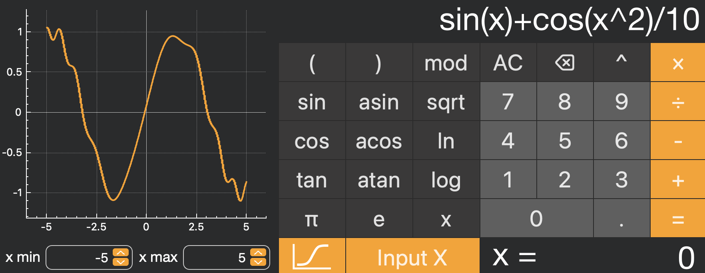
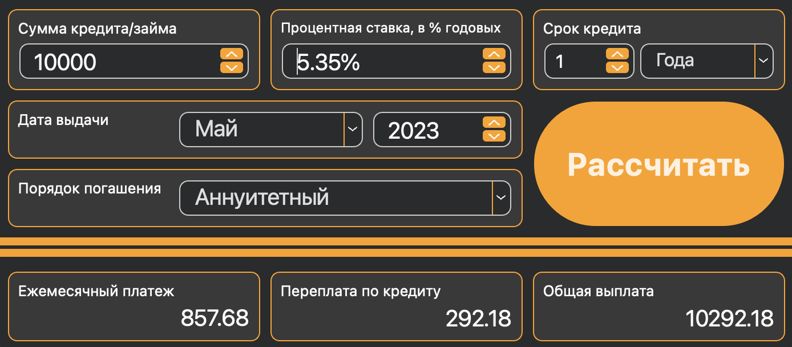

## Introduction

Implementation of extended version of the usual calculator, in the C language. In addition, implemented the ability to calculate arithmetic expressions by following the order, as well as some mathematical functions (sine, cosine, logarithm, etc.).
Support's the use of the x variable and the graphing of the corresponding function.



In addition, implemented separate credit module to calculate Annuity/Differentiated loans.


## Build
#### Prerequisites
- gcc compiler
- check.h library
- lcov
- cmake
- qt 6.5.0 (and higher)
- doxygen

```
git clone https://github.com/vlasashk/SmartCalc_V1.0.git
cd SmartCalc_V1.0/src/
make
```

To generate HTML report about code test coverage (lcov)
```
make gcov_report
```

To generate Documentation (doxygen)
```
make dvi
```
## Project information
### Implementation
- Reverse Polish Notation to parse and process initial input
- QTCreator for GUI
- Doxygen to generate documentation
- QCustomPlot for graphing module

### Supported arithmetic operators

| Operator name  | Infix notation <br /> (Classic) | Postfix notation <br /> (Reverse Polish notation) |
|----------------|---------------------------------|---------------------------------------------------|
| Brackets       | (a + b)                         | a b +                                             |
| Addition       | a + b                           | a b +                                             |
| Subtraction    | a - b                           | a b -                                             |
| Multiplication | a * b                           | a b *                                             |
| Division       | a / b                           | a b \                                             |
| Power          | a ^ b                           | a b ^                                             |
| Modulus        | a mod b                         | a b mod                                           |
| Unary minus    | -a                              | a-                                                |

### Supported functions
| Function description       | Function |
|----------------------------|----------|
| Computes cosine            | cos(x)   |
| Computes sine              | sin(x)   |
| Computes tangent           | tan(x)   |
| Computes arc cosine        | acos(x)  |
| Computes arc sine          | asin(x)  |
| Computes arc tangent       | atan(x)  |
| Computes square root       | sqrt(x)  |
| Computes natural logarithm | ln(x)    |
| Computes common logarithm  | log(x)   |

### Credit calculator
- Input: total credit amount, term, interest rate, type (annuity, differentiated)
- Output: monthly payment, overpayment on credit, total payment
     